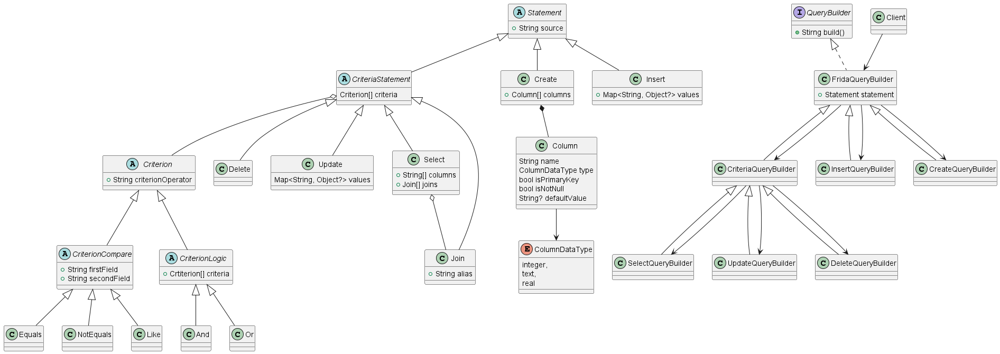

# Frida Query Builder 

A dart library to create Sqlite queries programatically.

## Diagram class



## Usage

### Build a create query

```dart
FridaQueryBuilder(
  Create(
    tableName: "students",
    columns: [
      Column(
          name: "student_id",
          type: ColumnDataType.integer,
          isAutoIncrement: true,
          isPrimaryKey: true),
      Column(
        name: "name",
        type: ColumnDataType.text,
      ),
      Column(
        name: "email",
        type: ColumnDataType.text,
        isNotNull: true
      ),
    ],
  ),
).build();
```
Output:
```sql
  CREATE TABLE students (
    student_id INTEGER AUTO INCREMENT  ,
    name TEXT  ,
    email TEXT NOT NULL ,
    PRIMARY KEY ( student_id)
  );
```

### Build a basic select query
```dart
FridaQueryBuilder(
  Select(
      from: "students",
  ),
).build();
```

Output:
```sql
  SELECT * FROM person
```

### Build a complex select query


```dart
FridaQueryBuilder(
  Select(
    from: "students",
    columns: [
      Field("s.name"),
      Field("s.student_id"),
      Field("s.email"),
      Field('"Text" AS simpleText '),
      2,
      2.22,
      "Text x2"
    ],
    joins: [
      Join(
        "student_classes",
        alias: "c",
        criteria: [
          Equals(
            Field("c.student_id"),
            Field("s.student_id"),
          ),
          NotEquals(
            Field("c.description"),
            "math",
          ),
        ],
      )
    ],
    alias: "s",
    limit: 2,
    offset: 3,
    orderBy: ["c.description"],
    criteria: [
      In(Field("s.name"), ["Felipe", "Juan"]),
      Or(
        [
          Equals("b", "b"),
          And([Equals("1", "1"), Equals("1", "1")])
        ],
      )
    ],
  ),
).build();

```

Output:
```sql
  SELECT s.name , s.student_id , s.email , "Text" AS simpleText  , 2 , 2.22 , "Text x2"
  FROM students AS s
  INNER JOIN student_classes AS c
  ON  c.student_id = s.student_id  AND  c.description <> "math" 
  WHERE  s.name IN ( "Felipe" , "Juan" )  OR (  "b" = "b"  AND (  "1" = "1"  AND  "1" = "1"  )  ) 
  ORDER BY c.description
  LIMIT 2 OFFSET 3
```

### Build an update query

```dart
FridaQueryBuilder(
  Update(
    table: "students",
    values: {"name": "Juan"},
    criteria: [
      Equals(Field("name"), "Felipe"),
    ],
  ),
).build();
```

Output:
```sql
UPDATE students SET name = "Juan" 
WHERE  name = "Felipe"
```

### Build a delete query

```dart
FridaQueryBuilder(
  Delete(
    table: "students",
    criteria: [
      Equals(Field("name"), "Felipe"),
    ],
  ),
).build();
```

Output:
```sql
DELETE students 
WHERE  name = "Felipe" 
```